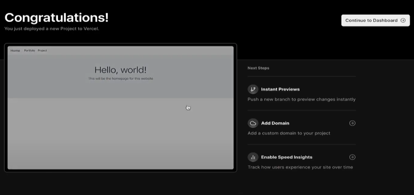

# Starsector Mockup Web Page


A mockup web page for an indie game Starsector. The project is constructed with simple HTML, CSS, JavaScript, and deployed through Vercel. You can access the page [Here](https://starsector.site/).

## Getting Started

To edit and preview the page from an IDE (preferably VS Code), you need to install some extension first.

1. Live Server

    This extension is required to run the html script into a browser. Live Server also live reload feature that automatically update the page layout by restarting the page every time there is an update on the source repository.

    

2. Live Preview

    Unlike Live Server, Live Preview runs the html script and displays the preview from VS Code itself. Also, every small change on the html files will be automatically implemented inside the preview.

    

## Setup

To set the repo into a development environment, the required steps are:

1. Clone the repo

    ```shell
    git clone https://github.com/Abk1708/module-2-Abk1708.git
   ```

2. Navigate into the project directory by using git bash

    ```shell
    cd module-2-Abk1708
   ```

3. Access the index file with VS Code

    ```shell
    code index.html
   ```

## Link The Repository into Vercel

The following part will cover the steps on setting the web page to be automatically deployed by using Vercel as the deployment app. The first steps are:

1. Visit the web deployment app. For this instance, we will be using Vercel. Then, click on the sign-up button to set up your account and connect your GitHub repositories.

    

2. You will be required to fill in your name and your plan type. Just chose Hobby for the plan type.

    

3. Next, you will need to connect your git provider. Choose “Continue with GitHub” to connect your GitHub repositories.

    

4. Next, you’ll be required to fill in your email that has been registered by GitHub.

    

5. Authorize Vercel to verify your GitHub account by pressing the “Authorize Vercel” button.

    

6. After connecting your GitHub Account, you will be taken into the Import Git Repository page.

    

7. Next, add your GitHub account.

    

8. Vercel will ask for your permission to install itself into your GitHub account and access your repository.  Select All Repositories or Only select repositories.

    

9. Then, press the Install button.

    

10. After installing Vercel into your account, your GitHub repositories will appear inside the repositories window. Select which repository you want to deploy.

    

11. Then, you’ll be taken to the Configure Project page. Set your project name and framework preset to your suiting. When you’re done, press the Deploy button to deploy your project.

    

12. The deployment process will take some time. After that, you’ll be greeted with this page if the deployment process is successful.

    

13. Now, your web page has been set and ready to be accessed anywhere and anytime. Select your web page link to see the full details.

    

14. In this page, you can see all the details such as which GitHub branch and commit Vercel use, your current domain, and how much time Vercel need to deploy your web. Press the drop-down menu to copy the URL. This URL will be used to access your deployed web page.

    

## Set Custom Domain for Vercel

Every time you deploy your project to Vercel, it will automatically set up a domain for your project. For this instance, we will not use the default domain and set-up a custom domain for your project. The required steps are:

1. First, you’ll need to visit a website that provides and sells domain names. For this instance, we’ll be visiting Niagahoster. Select the log in button to set up your account.

    

2. Select Google accounts to log in into Niagahoster.

    

3. After logging in, you need to create a name for your domain and select your preferred domain extension.

    

4. After you’ve chosen which domain to use, proceed to the checkout pages and select your payment method.

    

5. After finishing your payment, go to the domain tab and into the DNS/Nameservers section. In this page, you can change your DNS record and Nameservers.

    

6. Now, navigate back to the Vercel page and go to the setting tab and into the Domains section. In this page, you can add and configure your custom domains.

    

7. Input your custom domain and press the Add button.

    

8. After adding your custom domain, you need to set up your DNS provider for your domain first. Copy all the required information.

    

9. Then, paste all the information into the Manage DNS records form and press the Add Record button.

    

10. Finally, your DNS record has been set for your custom domain. But it will take some time before the domain can propagate globally. Now, you can access your web page by using this custom domain instead of the default domain from Vercel.

    
